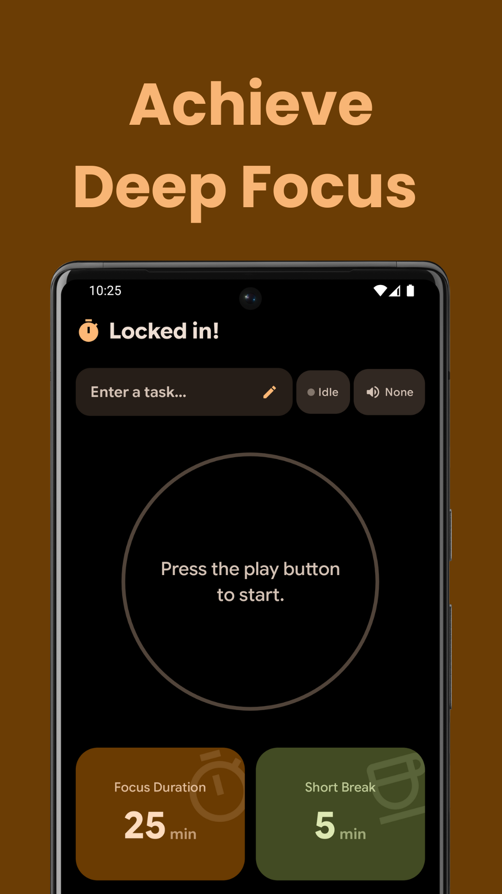
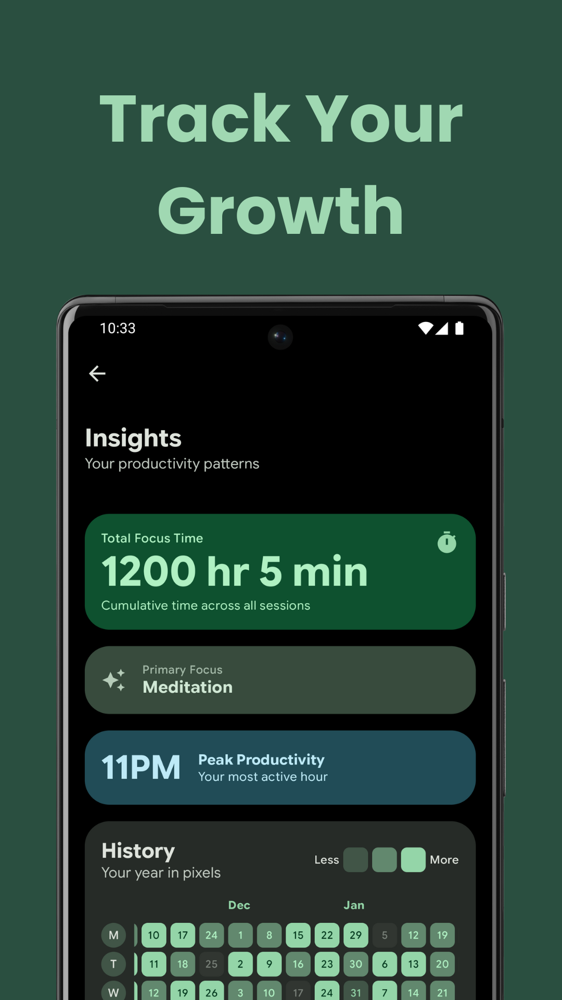
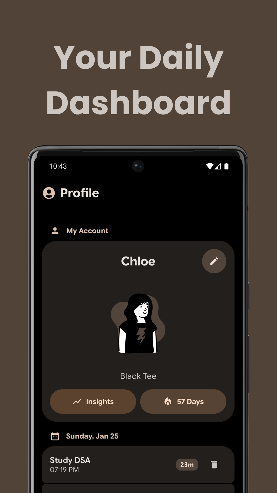
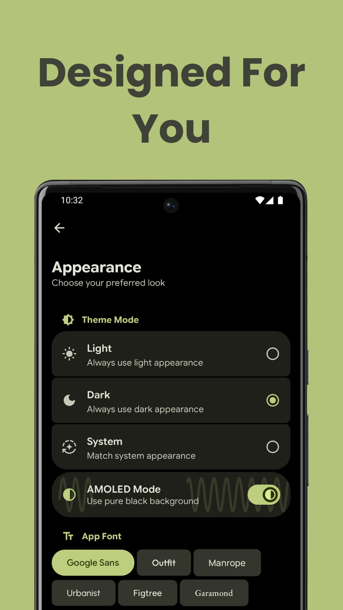
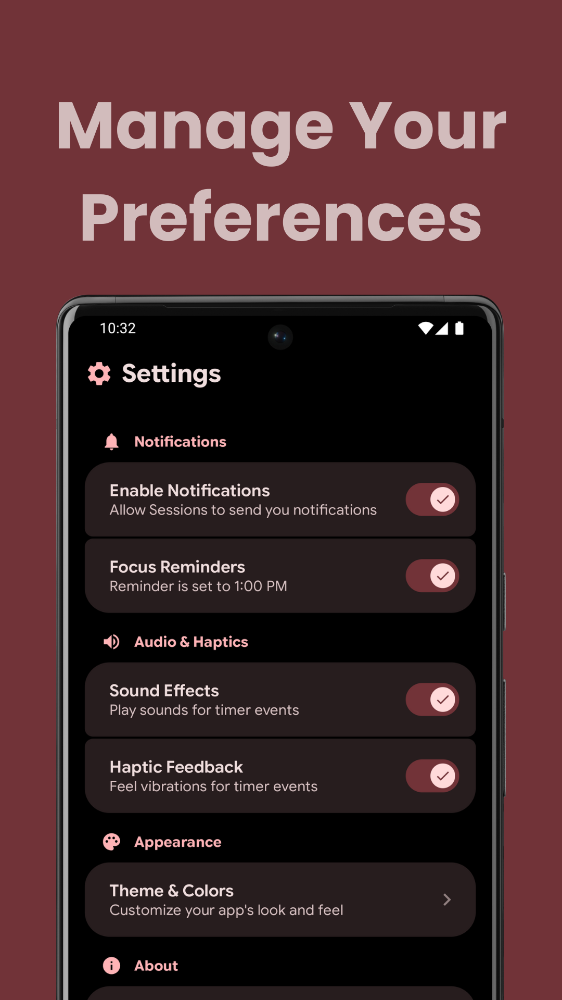
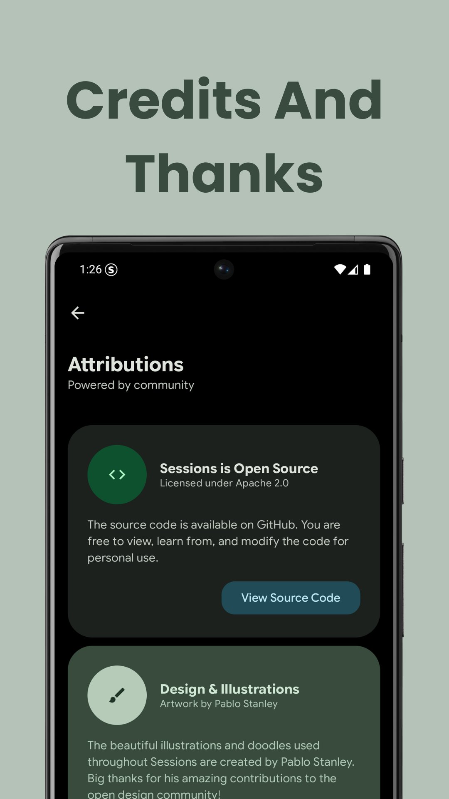
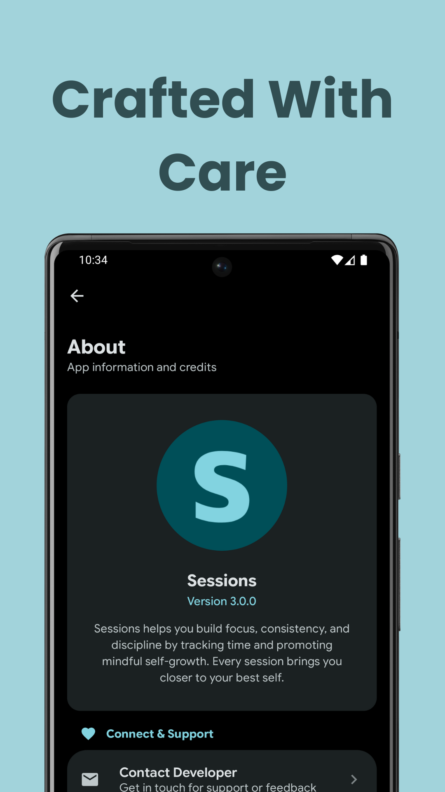

<div align="center">


<br/>

<table border="0" width="100%">
    <tr>
        <td width="30%" align="center" valign="middle">
            
        </td>
        <td width="70%" valign="middle">
            <h1>Sessions</h1>
            <h3>Your Personal Focus Companion</h3>
            <p><i>Precision-engineered productivity application designed to help you master your time and maintain flow state.</i></p>
        </td>
    </tr>
</table>

<p align="center">
  <a href="https://play.google.com/store/apps/details?id=com.yugentech.quill"></a>
  <a href="https://github.com/MohammadAliUstad/Sessions/releases"></a>
</p>

<br/>

[Report Bug](https://github.com/MohammadAliUstad/Sessions/issues) · [Request Feature](https://github.com/MohammadAliUstad/Sessions/issues) · [Download Latest Release](https://github.com/MohammadAliUstad/Sessions/releases)

</div>

---

## Overview

Sessions transforms the concept of a simple timer into a comprehensive focus tool. Whether you're studying, coding, or writing, the application ensures your environment is optimized for concentration. It features a robust background service that prevents the operating system from killing the timer, ensuring your progress is tracked even when your phone is locked.

---

## ✨ Key Features

### Intelligent Focus Engine
- **Customizable Cycles:** Define your exact Focus Duration, Break Duration, and Repetition count
- **Smart Intervals:** Automatically calculates when to trigger a Long Break based on your completed sets
- **Task History:** Assign names to specific sessions to recognize and review what you worked on later

### Immersive Audio Environment
- **Curated Ambience:** Includes 5 high-quality background sounds: Rain, Brown Noise, Fireplace, Library, and Riverside
- **Adaptive Audio Ducking:** Background volume intelligently lowers during breaks and rises during focus sessions
- **Sensory Feedback:** Integrated haptic feedback and sound effects confirm interactions without visual confirmation

### Reliability & System Integration
- **Persistent Notification:** Live notification on the lock screen allows you to track progress without unlocking
- **Background Stability:** Engineered to resist aggressive battery optimization

### Analytics & Personalization
- **Visual Insights:** Dedicated dashboard featuring heatmaps and metrics (Total Focus Time, Peak Productivity Hours)
- **Deep Theming:** 8 Color Themes (including Dynamic Material You), OLED Black Mode, and 6 Font options
- **Identity System:** Choose from a variety of avatars and set a custom display name

---

## 📱 Screenshots

<div align="center">

<table width="100%">
  <tr>
    <td align="center" width="25%">
      
      <br/><sub><b>Timer</b></sub>
    </td>
    <td align="center" width="25%">
      
      <br/><sub><b>Insights</b></sub>
    </td>
    <td align="center" width="25%">
      
      <br/><sub><b>Dashboard</b></sub>
    </td>
    <td align="center" width="25%">
       
      <br/><sub><b>Tasks History</b></sub>
    </td>
  </tr>
  <tr>
    <td align="center" width="25%">
      
      <br/><sub><b>Settings</b></sub>
    </td>
    <td align="center" width="25%">
      
      <br/><sub><b>Appearance</b></sub>
    </td>
    <td align="center" width="25%">
      
      <br/><sub><b>Edit Profile</b></sub>
    </td>
    <td align="center" width="25%">
      
      <br/><sub><b>About</b></sub>
    </td>
  </tr>
</table>

</div>

---

## Technical Architecture

Sessions is built using modern Android development standards, ensuring a codebase that is scalable, testable, and maintainable.

```text
Language:             Kotlin
UI Framework:         Jetpack Compose (Material 3)
Architecture:         MVVM + Clean Architecture
Dependency Injection: Koin
Local Database:       Room
Backend Services:     Firebase (Auth, Firestore)
Concurrency:          Kotlin Coroutines & Flow
```

### Tech Stack

* **Kotlin** - Modern, concise, and safe programming language
* **Jetpack Compose** - Declarative UI toolkit for building native Android interfaces
* **Material 3** - Latest Material Design system for beautiful, accessible UIs
* **MVVM Architecture** - Separation of concerns for maintainable code
* **Room Database** - Robust local data persistence
* **Firebase** - Cloud services for authentication and data sync
* **Coroutines & Flow** - Asynchronous programming made simple

---

## Setup & Installation

### Prerequisites

* Android Studio (latest version recommended)
* JDK 11 or higher
* Android SDK API 24+

### Steps

1. **Clone the Repository**
```bash
git clone https://github.com/MohammadAliUstad/Sessions.git
cd Sessions
```

2. **Firebase Configuration**
* Create a project in the [Firebase Console](https://console.firebase.google.com/)
* Download the `google-services.json` file
* Place the file in the `app/` directory of the project

3. **Build & Run**
* Open the project in Android Studio
* Sync Gradle files
* Select your target device/emulator
* Click Run ▶️

---

## 🤝 Contributing

Contributions are what make the open source community such an amazing place to learn, inspire, and create. Any contributions you make are **greatly appreciated**.

1. Fork the Project
2. Create your Feature Branch (`git checkout -b feature/AmazingFeature`)
3. Commit your Changes (`git commit -m 'Add some AmazingFeature'`)
4. Push to the Branch (`git push origin feature/AmazingFeature`)
5. Open a Pull Request

---

## 📄 License

Distributed under the appropriate license. See `LICENSE` file for more information.

---

## Contact & Support

If you encounter any issues or have suggestions for future updates, please open an issue on GitHub or contact the developer directly.

**Developer:** Mohammad Ali Ustad

**Email:** Mohammadaliustad@gmail.com

**Company:** Yugen Tech

<div align="center">

### Show Your Support

If you find this project helpful, please consider giving it a ⭐!

</div>

---

<div align="center">
<sub>Built with ❤️ by Yugen Tech</sub>
</div>
