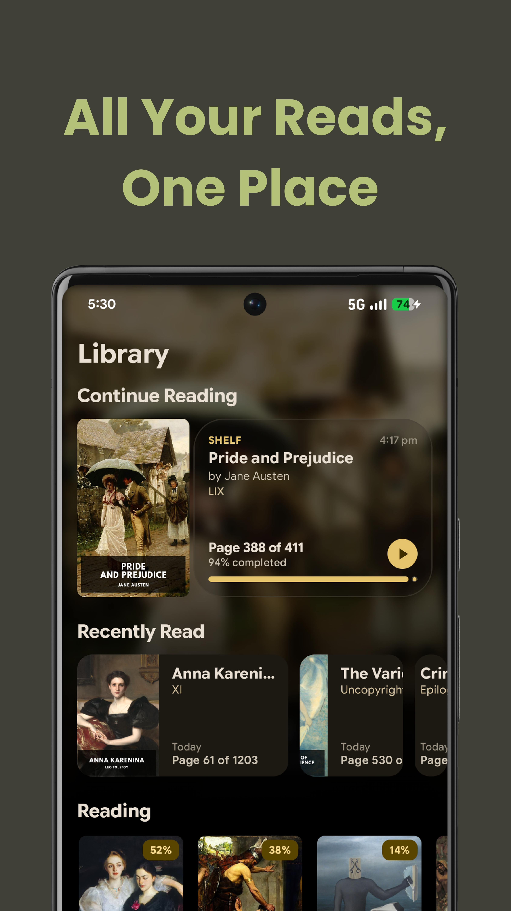
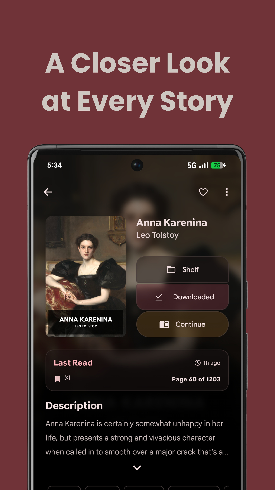
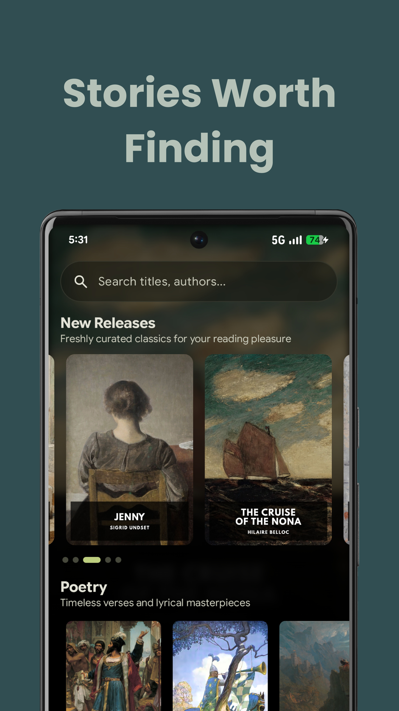
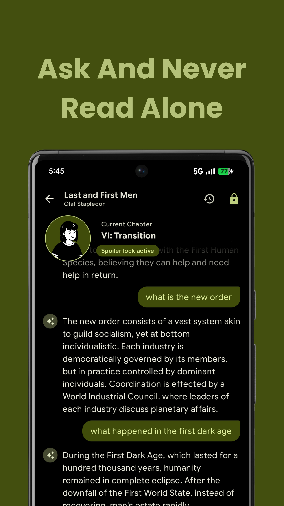
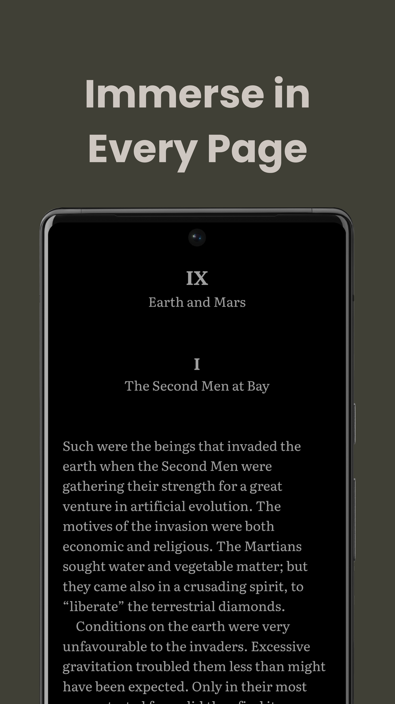
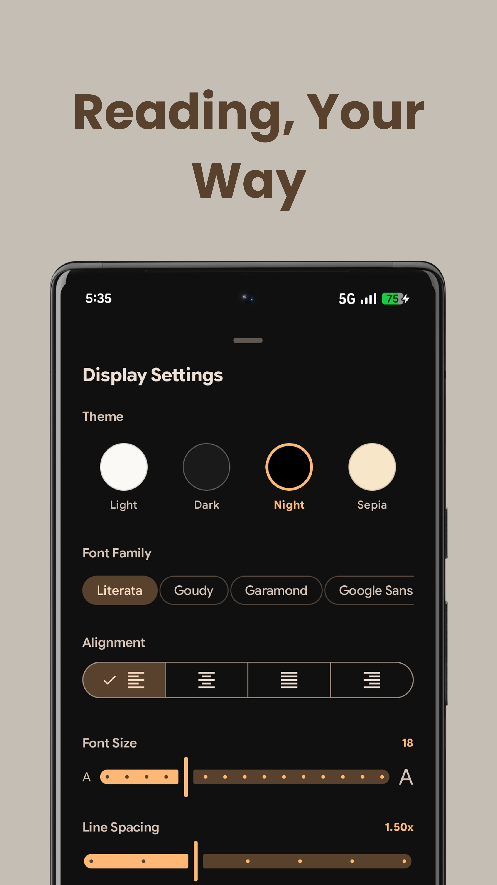
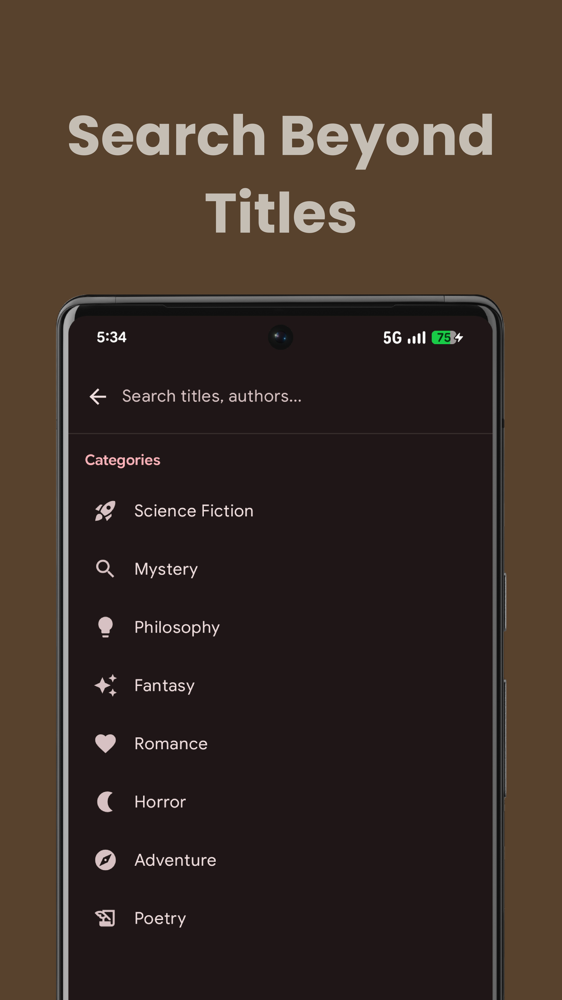
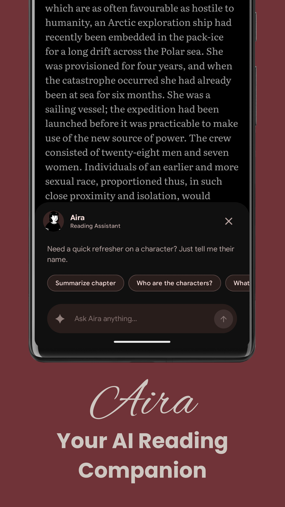

<div align="center">


<br/>

<table border="0" width="100%">
    <tr>
        <td width="30%" align="center" valign="middle">
            
        </td>
        <td width="70%" valign="middle">
            <h1>Quill</h1>
            <h3>Read Deeper. Think Further.</h3>
            <p><i>An intelligent EPUB reading companion that doesn't just hold your books, it understands them.</i></p>
        </td>
    </tr>
</table>

<p align="center">
  <a href="https://play.google.com/store/apps/details?id=com.yugentech.quill"></a>
  <a href="https://github.com/MohammadAliUstad/Quill/releases"></a>
</p>

<br/>

[Report Bug](https://github.com/MohammadAliUstad/Quill/issues) · [Request Feature](https://github.com/MohammadAliUstad/Quill/issues) · [Download Latest Release](https://github.com/MohammadAliUstad/Quill/releases)

</div>

---

## Overview

Quill reimagines what a reading app can be. Built for readers who want more than a page-turner, Quill combines a beautifully crafted EPUB reader with Aira, an AI reading companion powered by Gemini that can discuss your book, answer questions about the story, and help you understand the text at a deeper level. With access to thousands of free classics via Project Gutenberg and a RAG pipeline that understands narrative context, Quill is the reading experience books deserve.

---

## ✨ Key Features

### Aira — Your AI Reading Companion
- **Intelligent Query Routing:** Aira automatically classifies your question — whether it needs book-specific passage retrieval or can be answered from general literary knowledge — and responds accordingly
- **On-Device RAG Pipeline:** A hybrid retrieval system combining BGE semantic embeddings (ONNX Runtime) and FTS4 keyword search, merged via Reciprocal Rank Fusion, surfaces the most relevant passages from your book before answering
- **Asymmetric Retrieval:** For character and event queries, FTS acts as a boolean filter to narrow the vector search corpus, eliminating name-density bias and surfacing the right scenes even in long novels
- **Query Expansion:** Each question is rewritten into multiple semantic variations with entity extraction and keyword boosting, dramatically improving retrieval precision
- **Spoiler Lock:** Aira only discusses content you've already read it won't reveal what happens next
- **Conversation History:** Full multi-turn conversation with history-aware responses, dead-end filtering, and persistent storage per book
- **Quick Actions:** One-tap prompts to summarize a chapter, identify characters, explore themes, look up words, explain passages, and more

### EPUB Reader
- **Full EPUB Support:** Clean, distraction-free reading experience with smooth chapter navigation
- **Reading Progress Tracking:** Tracks your progress per book, per chapter, with percentage completion
- **Customizable Experience:** Personalize your reading environment with themes and font options
- **Resume Anywhere:** Instantly jump back to where you left off across sessions

### Gutenberg Library
- **Thousands of Free Classics:** Browse and download public domain books directly from Project Gutenberg
- **Popular Feed:** Discover trending titles with paginated browsing and automatic sync
- **Smart Search:** Find books by title, author, or subject across the entire Gutenberg catalog
- **Retry & Resilience:** Exponential backoff retry logic ensures downloads succeed even on unstable connections

### Cloud Sync & Personalization
- **Cross-Device Sync:** Your library, reading progress, and Aira conversations sync seamlessly via Firebase
- **Deep Theming:** Multiple color themes with OLED black mode support
- **Identity System:** Custom display name and avatar for a personalized reading profile
- **Statistics & Insights:** Track your reading habits, session lengths, and books completed over time

---

## 📱 Screenshots

<div align="center">

<table width="100%">
  <tr>
    <td align="center" width="25%">
      
      <br/><sub><b>Library</b></sub>
    </td>
    <td align="center" width="25%">
      
      <br/><sub><b>Details</b></sub>
    </td>
    <td align="center" width="25%">
      
      <br/><sub><b>Discover</b></sub>
    </td>
    <td align="center" width="25%">
       
      <br/><sub><b>Aira</b></sub>
    </td>
  </tr>
  <tr>
    <td align="center" width="25%">
      
      <br/><sub><b>Reader</b></sub>
    </td>
    <td align="center" width="25%">
      
      <br/><sub><b>Settings</b></sub>
    </td>
    <td align="center" width="25%">
      
      <br/><sub><b>Search</b></sub>
    </td>
    <td align="center" width="25%">
      
      <br/><sub><b>AI</b></sub>
    </td>
  </tr>
</table>

</div>

---

## Technical Architecture

Quill is built on modern Android development standards with a multi-module architecture, ensuring a codebase that is scalable, testable, and maintainable.

```text
Language:             Kotlin
UI Framework:         Jetpack Compose (Material 3 Expressive)
Architecture:         MVVM + Clean Architecture (Multi-Module)
Dependency Injection: Koin
Local Database:       Room (with FTS4 for full-text search)
AI Companion:         Gemini 2.5 Flash (Aira) via Firebase Cloud Functions
Embeddings:           BAAI/bge-small-en-v1.5 (ONNX Runtime, int8 quantized)
RAG Pipeline:         Hybrid Vector + FTS4 with Asymmetric Retrieval
Networking:           Ktor (with exponential backoff retry)
Book Source:          Project Gutenberg
Backend Services:     Firebase (Auth, Firestore, Cloud Functions)
Concurrency:          Kotlin Coroutines & Flow
```

### Tech Stack

* **Kotlin** — Modern, concise, and safe programming language
* **Jetpack Compose** — Declarative UI toolkit with Material 3 Expressive components
* **MVVM + Clean Architecture** — Multi-module separation of concerns for maintainable, scalable code
* **Room + FTS4** — Robust local data persistence with full-text search indexing across book chunks
* **ONNX Runtime** — On-device inference for BGE sentence embeddings without server dependency
* **Gemini 2.5 Flash** — Powers Aira's conversational intelligence and query routing via Firebase Cloud Functions
* **Ktor** — Lightweight HTTP client for Gutenberg API with retry resilience
* **Firebase** — Authentication, Firestore sync, and Cloud Functions backend
* **Coroutines & Flow** — Fully asynchronous pipeline from retrieval to response

---

## Setup & Installation

### Prerequisites

* Android Studio (latest version recommended)
* JDK 17 or higher
* Android SDK API 26+

### Steps

1. **Clone the Repository**
```bash
git clone https://github.com/MohammadAliUstad/Quill.git
cd Quill
```

2. **Firebase Configuration**
   * Create a project in the [Firebase Console](https://console.firebase.google.com/)
   * Download the `google-services.json` file
   * Place the file in the `app/` directory of the project
   * Deploy the Cloud Functions from the `/functions` directory:
```bash
cd functions
npm install
firebase deploy --only functions
```

3. **ONNX Model Setup**
   * Place the `bge-small-en-v1.5.onnx` and `tokenizer.json` files in the `assets/` directory of the AI module

4. **Build & Run**
   * Open the project in Android Studio
   * Sync Gradle files
   * Select your target device/emulator
   * Click Run ▶️

---

## 🤝 Contributing

Contributions are what make the open source community such an amazing place to learn, inspire, and create. Any contributions you make are **greatly appreciated**.

1. Fork the Project
2. Create your Feature Branch (`git checkout -b feature/AmazingFeature`)
3. Commit your Changes (`git commit -m 'Add some AmazingFeature'`)
4. Push to the Branch (`git push origin feature/AmazingFeature`)
5. Open a Pull Request

---

## 📄 License

Distributed under the appropriate license. See `LICENSE` file for more information.

---

## Contact & Support

If you encounter any issues or have suggestions for future updates, please open an issue on GitHub or contact the developer directly.

**Developer:** Mohammad Ali Ustad

**Email:** Mohammadaliustad@gmail.com

**Company:** Yugen Tech

<div align="center">

### Show Your Support

If you find this project helpful, please consider giving it a ⭐!

</div>

---

<div align="center">
<sub>Built with ❤️ by Yugen Tech</sub>
</div>