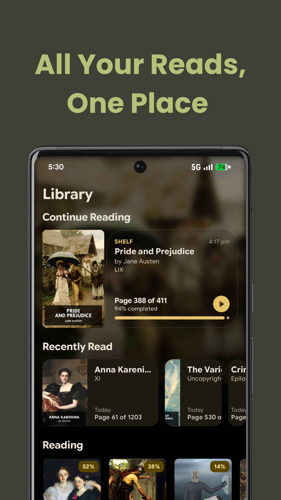
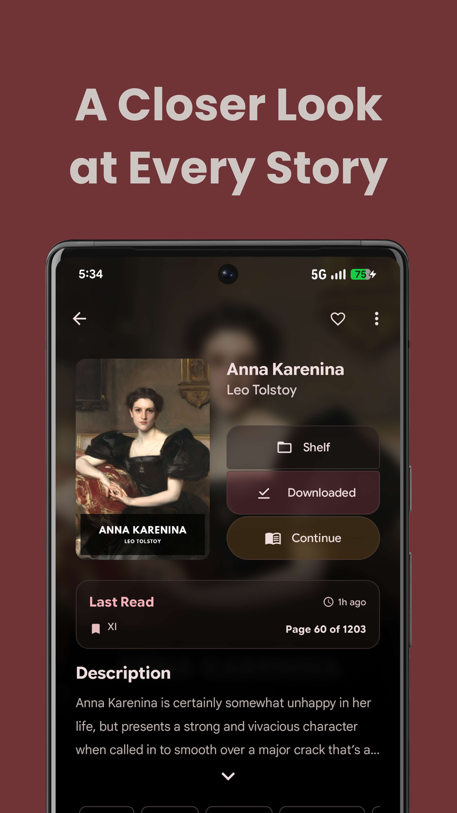
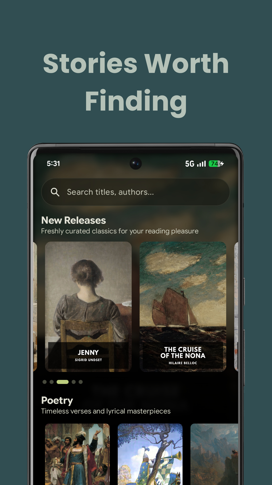
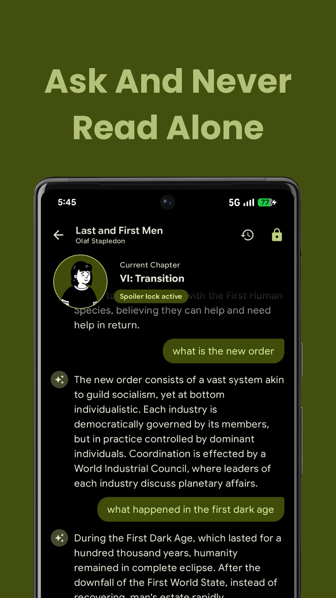
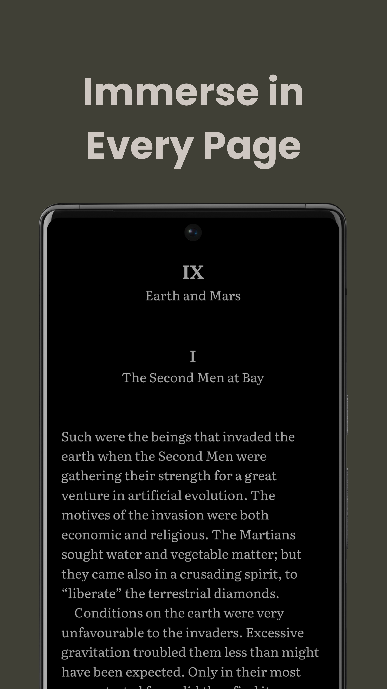
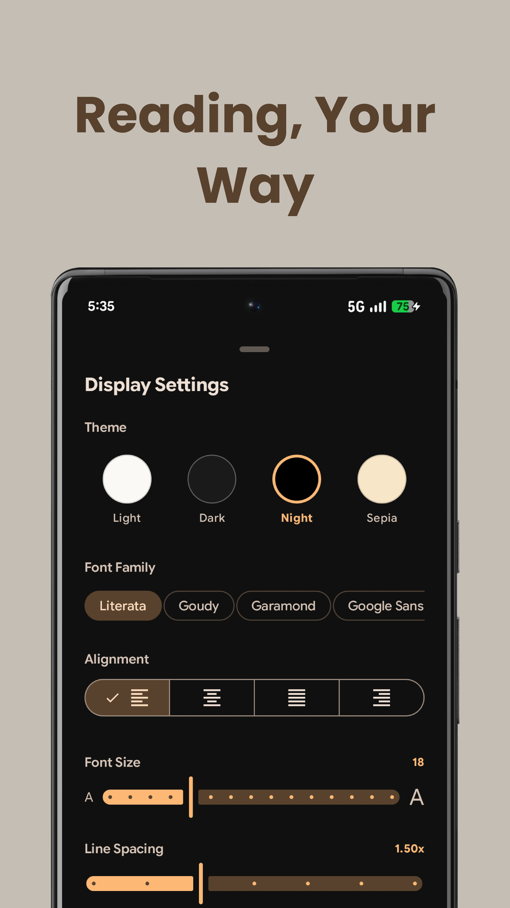
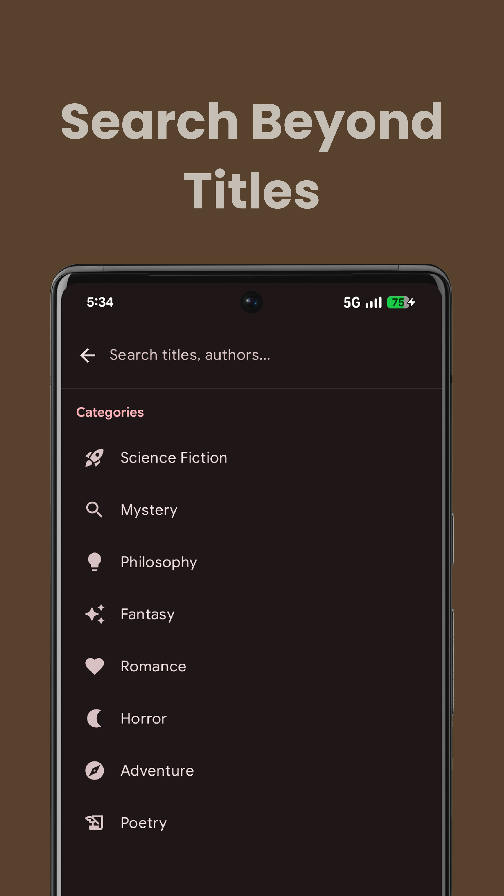
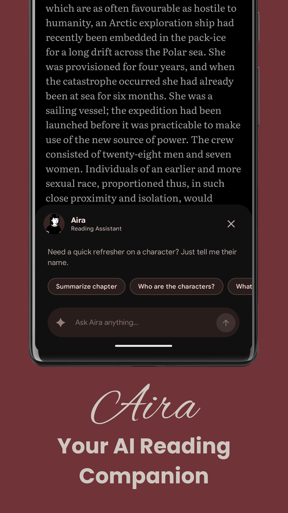

<div align="center">


<br/>

<table border="0" width="100%">
    <tr>
        <td width="30%" align="center" valign="middle">
            
        </td>
        <td width="70%" valign="middle">
            <h1>Quill</h1>
            <h3>Read Deeper. Think Further.</h3>
            <p><i>An intelligent EPUB reading companion that doesn't just hold your books, it understands them.</i></p>
        </td>
    </tr>
</table>

<p align="center">
  <a href="https://play.google.com/store/apps/details?id=com.yugentech.quill"></a>
  <a href="https://github.com/MohammadAliUstad/Quill/releases"></a>
</p>

<br/>

[Report Bug](https://github.com/MohammadAliUstad/Quill/issues) · [Request Feature](https://github.com/MohammadAliUstad/Quill/issues) · [Download Latest Release](https://github.com/MohammadAliUstad/Quill/releases)

</div>

---

## Table of Contents

- [Overview](#overview)
- [Key Features](#-key-features)
- [Screenshots](#-screenshots)
- [How Aira Works](#how-aira-works)
- [Technical Architecture](#technical-architecture)
- [Setup & Installation](#setup--installation)
- [Contributing](#-contributing)
- [License](#-license)
- [Contact & Support](#contact--support)

---

## Overview

Quill reimagines what a reading app can be. It pairs a carefully crafted EPUB reader with **Aira**, an AI reading companion that reads along with you. Aira answers questions about your book straight from its pages, explains difficult passages, helps you keep track of characters, and can even paint a scene you're reading, all without ever spoiling what comes next.

Bring your own EPUBs or pick from thousands of free classics on **Project Gutenberg** and **Standard Ebooks**, set the mood with ambient soundscapes, and build a steady reading habit with reminders and insights.

---

## ✨ Key Features

### Aira, Your AI Reading Companion

- **Grounded in the text:** Aira answers from the actual passages of your book, retrieved on-device, not from guesswork.
- **Spoiler lock:** her knowledge is locked to your reading progress. She never reveals events from chapters you haven't reached.
- **Smart routing:** Aira works out whether you're asking about your book or about something general, and answers each the right way.
- **Full conversations:** chat naturally about the plot, characters, themes, or world-building. History is kept per book, with a clear current-chapter header.
- **Read aloud:** listen to any of Aira's answers, spoken with natural-sounding text-to-speech.

### Ask Aira From the Page

Select text while reading and the Aira peek bar offers quick actions based on what you picked:

| You select | Quick actions |
|---|---|
| Nothing | Summarize chapter · Who are the characters? · What are the themes? |
| A word | Define · What is this? |
| A name | **Who is this?** · **Recent Role** · **Journey So Far** |
| A short phrase | Explain this |
| A passage | Explain this · What's the significance? · **Visualize this** |

- **Character companion:** recall who a character is, see what they're up to lately, or trace their whole journey through the story so far.
- **Chapter summaries** are built from the full chapter text, and theme questions consider the current chapter alongside the rest of what you've read.
- Answers type out smoothly, and if you select something that isn't a character's name, Aira kindly tells you so.

### Visualize Scenes

- Turn any descriptive passage into a **painted, oil-style illustration**.
- Every image is saved to a per-book **Visuals gallery**.
- **Go to Passage** jumps straight back to the exact spot in the book the image came from.

### The Reader

- **Readium-powered EPUB engine** with smooth chapter navigation and accurate progress tracking.
- **Reading settings:** fonts, text size, spacing, page themes, and paged or scrolling layout.
- **Custom text selection and highlights,** with a Highlights screen to revisit every highlight and jump back to it.
- **Table of contents** sheet, progress slider, and resume-where-you-left-off.
- **Night light:** a warm amber tint for comfortable late-night reading.
- **Volume-key page turning.**

### Ambient Sounds

- Six soundscapes: **Forest, Rain, Brown Noise, Fireplace, Library, Riverside**.
- Preview sounds before playing, start and stop from the reader overlay, and optionally **auto-play on open**.
- Seamless looping with crossfades.

### Library & Sources

- **Import your own EPUBs** from anywhere on your device.
- **Project Gutenberg:** browse, search, and download 60,000+ free books.
- **Standard Ebooks:** carefully formatted, high-quality public domain editions.
- **Discover** tab with a hero carousel and curated shelves.
- **Categories:** organize books your way, with drag-and-drop reordering.
- **Storage management:** see how much space each book uses and clean up.

### Habits & Insights

- **Reading insights:** time read, day streak, books finished, a reading heatmap, peak reading hours, favorite authors, library progress, and your Aira activity.
- **Daily reading reminder** at a time you choose, plus optional **playful reminders** to keep your streak alive.

### Personalization & Account

- Multiple **color themes** (including Harbor), light and dark modes, **AMOLED black**, and dynamic color.
- **Cloud sync** of your library and categories across devices via Firebase.
- Profile with display name and avatar.

### Quill Pro

| | Basic Reader | Quill Pro |
|---|---|---|
| Full reader, sources, sounds, highlights, insights | ✅ | ✅ |
| Daily Aira queries | 5 | 50 |
| Visualize (3 queries per image) | ✅ | ✅ |

Quotas reset daily. Subscriptions are handled through Google Play Billing.

---

## 📱 Screenshots

<div align="center">

<table width="100%">
  <tr>
    <td align="center" width="25%">
      
      <br/><sub><b>Library</b></sub>
    </td>
    <td align="center" width="25%">
      
      <br/><sub><b>Details</b></sub>
    </td>
    <td align="center" width="25%">
      
      <br/><sub><b>Discover</b></sub>
    </td>
    <td align="center" width="25%">
       
      <br/><sub><b>Aira</b></sub>
    </td>
  </tr>
  <tr>
    <td align="center" width="25%">
      
      <br/><sub><b>Reader</b></sub>
    </td>
    <td align="center" width="25%">
      
      <br/><sub><b>Settings</b></sub>
    </td>
    <td align="center" width="25%">
      
      <br/><sub><b>Search</b></sub>
    </td>
    <td align="center" width="25%">
      
      <br/><sub><b>AI</b></sub>
    </td>
  </tr>
</table>

</div>

---

## How Aira Works

Aira combines **on-device retrieval** with **server-side generation**. Your book is indexed on the phone; only the handful of relevant passages for a given question are sent to the model.

### 1. On-device indexing

When a book is added, a background worker (WorkManager) processes it:

1. The EPUB is split into chunks of about 1,500 characters with a 250-character overlap.
2. Each chunk is embedded with **BAAI/bge-small-en-v1.5**, running locally through **ONNX Runtime**.
3. Chunks and their embeddings are stored in **Room**, with an **FTS4** full-text index alongside.

### 2. Retrieval

- **Hybrid search:** semantic vector similarity and FTS4 keyword matching, merged with **Reciprocal Rank Fusion**.
- **Spoiler lock:** retrieval is capped at the reader's current chapter, so passages from unread chapters are never sent.
- **Action-specific strategies** for the character tools:
  - **Who is this?** takes the character's first mentions verbatim, then spreads picks evenly across your reading progress in zones, ranked by how much each passage actually describes them (personality, role, relationships, appearance).
  - **Recent Role** uses their latest appearances.
  - **Journey So Far** splits their arc 20/60/20: their introduction, a scattered and semantically ranked middle, and their most recent scenes.
  - Overlapping duplicate chunks are removed, and a per-chapter cap stops any single chapter from dominating.
- **Chapter summaries** read the chapter straight from the EPUB rather than stitching overlapping chunks back together.

### 3. Generation

Retrieved passages and a task-specific prompt go to **Firebase Cloud Functions**, which call Google's models:

| Task | Model / Service |
|---|---|
| Chat, quick actions, intent routing | Gemini 2.5 Flash-Lite |
| Visualize (illustrations) | Gemini 2.5 Flash Image |
| Read aloud | Google Cloud Text-to-Speech |

Prompts enforce strict grounding and attribution: Aira states only what the passages show, never borrows a detail from a different character, and stays spoiler-free.

---

## Technical Architecture

Quill uses a multi-module MVVM + Clean Architecture setup.

```text
Quill/
├── app/        Main app: navigation, library, sources, Aira chat, insights, settings,
│               notifications, billing & quota, cloud sync, onboarding
├── reader/     Readium-based EPUB reader: engine, overlay, settings, highlights,
│               ambient sounds, Aira peek bar
├── aira/       AI layer: RAG retriever, ONNX embeddings, chunking, intent detection,
│               book / general / quick chat services, voice output
├── database/   Room database, DAOs, entities, FTS4 index, migrations
├── domain/     Shared models and repository interfaces
├── theme/      Design system: color schemes, typography, design tokens, haptics
└── functions/  Firebase Cloud Functions (TypeScript): bookChat, generalChat, quickChat,
                detectIntent, visualizeScene, speakText
```

### Tech Stack

```text
Language:             Kotlin 2.3
UI:                   Jetpack Compose, Material 3 Expressive, Haze (blur), Coil
Architecture:         MVVM + Clean Architecture (multi-module)
Dependency Injection: Koin
EPUB Engine:          Readium Kotlin Toolkit
Local Storage:        Room (+ FTS4), DataStore
Background Work:      WorkManager, AlarmManager
Audio:                Media3 ExoPlayer
Embeddings:           BAAI/bge-small-en-v1.5 via ONNX Runtime (on-device)
AI Models:            Gemini 2.5 Flash-Lite, Gemini 2.5 Flash Image
Speech:               Google Cloud Text-to-Speech
Networking:           Ktor (Gutendex API, Standard Ebooks OPDS)
Backend:              Firebase Auth, Firestore, Cloud Functions, Crashlytics, Analytics
Payments:             Google Play Billing
Concurrency:          Kotlin Coroutines & Flow
Min / Target SDK:     26 / 37
```

---

## Setup & Installation

### Prerequisites

- Android Studio (latest stable recommended)
- JDK 17 or higher
- Android SDK with API 37 installed (the app runs on API 26+)
- Node.js 24 and the Firebase CLI (for Cloud Functions)
- A Firebase project on the **Blaze** plan (required for Cloud Functions and outbound API calls)

### 1. Clone the repository

```bash
git clone https://github.com/MohammadAliUstad/Quill.git
cd Quill
```

### 2. Configure Firebase

1. Create a project in the [Firebase Console](https://console.firebase.google.com/).
2. Add an Android app with the package name `com.yugentech.quill`.
3. Download `google-services.json` and place it in the `app/` directory.
4. Enable **Authentication**, **Firestore**, and **Crashlytics**.

### 3. Deploy the Cloud Functions

```bash
cd functions
npm install

# Gemini API key used by the chat, intent, and Visualize functions
firebase functions:secrets:set GEMINI_API_KEY

firebase deploy --only functions
```

For **read aloud**, enable the **Cloud Text-to-Speech API** in the Google Cloud project linked to Firebase.

### 4. Add the embedding model

Place the ONNX export of `bge-small-en-v1.5` and its tokenizer in the `aira` module's assets:

```text
aira/src/main/assets/model.onnx
aira/src/main/assets/tokenizer.json
```

### 5. Build & run

1. Open the project in Android Studio and sync Gradle.
2. Select a device or emulator.
3. Click **Run ▶️**.

> **Quill Pro (optional):** to test subscriptions, create a subscription with the product ID `quill_pro_monthly` in the Google Play Console.

---

## 🤝 Contributing

Contributions are what make the open source community such an amazing place to learn, inspire, and create. Any contributions you make are **greatly appreciated**.

1. Fork the project
2. Create your feature branch (`git checkout -b feature/AmazingFeature`)
3. Commit your changes (`git commit -m 'Add some AmazingFeature'`)
4. Push to the branch (`git push origin feature/AmazingFeature`)
5. Open a pull request

---

## 📄 License

Distributed under the **Apache License 2.0**. See the [`LICENSE`](LICENSE) file for details.

---

## Contact & Support

If you run into an issue or have an idea for a future update, please open an issue on GitHub or contact the developer directly.

**Developer:** Mohammad Ali Ustad

**Email:** Mohammadaliustad@gmail.com

**Company:** Yugen Tech

<div align="center">

### Show Your Support

If you find this project helpful, please consider giving it a ⭐!

</div>

---

<div align="center">
<sub>Built with ❤️ by Yugen Tech</sub>
</div>
